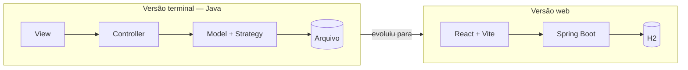

<picture>
  <source media="(prefers-color-scheme: dark)" srcset="https://readme-typing-svg.demolab.com?font=JetBrains+Mono&size=17&pause=1600&color=8FD3FF&center=true&vCenter=true&width=560&lines=Backend+%2B+full-stack;Estruturas+de+dados;Java+%C2%B7+Python+%C2%B7+C" />
  
</picture>

  

## Sobre

<table>
<tr><td><b>Quem sou</b></td><td>Estudante de Ciência da Computação, com formação técnica anterior em Redes de Computadores.</td></tr>
<tr><td><b>O que estudo</b></td><td>Ciência da Computação — UNICAP (programa C3), depois de migrar de Sistemas de Informação.</td></tr>
<tr><td><b>Interesses</b></td><td>Desenvolvimento full-stack, estruturas de dados e infraestrutura.</td></tr>
<tr><td><b>Construindo</b></td><td>Aplicações práticas que consolidam esses conceitos — como o Lumière Cinema, abaixo.</td></tr>
</table>

## Tech Stack

<picture>
  <source media="(prefers-color-scheme: dark)" srcset="https://skillicons.dev/icons?i=java,py,c,html,css,js&theme=dark" />
  
</picture>

<picture>
  <source media="(prefers-color-scheme: dark)" srcset="https://skillicons.dev/icons?i=react,vite,spring&theme=dark" />
  
</picture>

<picture>
  <source media="(prefers-color-scheme: dark)" srcset="https://skillicons.dev/icons?i=git,github,maven,vercel&theme=dark" />
  
</picture>

<picture>
  <source media="(prefers-color-scheme: dark)" srcset="https://skillicons.dev/icons?i=figma&theme=dark" />
  
</picture>

## Projeto em destaque — Lumière Cinema

Sistema de venda de ingressos de cinema, desenvolvido em equipe para a disciplina de Programação Orientada a Objetos da UNICAP, com fluxos distintos para usuário, crítico e administrador.

<a href="https://github.com/Furubioo/Sistema-de-Cinema-JAVA-">
  <picture>
    <source media="(prefers-color-scheme: dark)" srcset="https://github-readme-stats.vercel.app/api/pin/?username=Furubioo&repo=Sistema-de-Cinema-JAVA-&theme=tokyonight&hide_border=true" />
    
  </picture>
</a>

**Funcionalidades**
- Preços diferenciados por tipo de usuário (comum, crítico, estudante)
- Aplicação de cupons promocionais
- Sugestão de assentos e pôsteres de filme via API do TMDB
- Persistência em arquivo na versão terminal, evoluindo para um banco H2 na versão web

**Conceitos aplicados**
- Orientação a objetos: herança, sobrescrita e sobrecarga de métodos
- Padrões de projeto MVC e Strategy (este último para as regras de preço)
- Tratamento de exceções, incluindo uma exceção personalizada na base de código

**Evolução**
O projeto começou como uma aplicação em terminal, em Java. Depois foi estendido para uma aplicação web (front-end em React + Vite, back-end em Spring Boot, H2 como banco de dados) — o código dessa etapa foi gerado com apoio de ferramentas de IA, e minha contribuição foi a configuração do ambiente, a integração entre front-end e back-end, e a resolução de bugs.

## Em exploração agora

- Estruturas de dados não lineares — árvores e algoritmos de ordenação
- Projeto e modelagem de banco de dados
- Análise e projeto de software

## Projetos

<a href="https://side-da-ong-partilhar.vercel.app">
  <picture>
    <source media="(prefers-color-scheme: dark)" srcset="https://github-readme-stats.vercel.app/api/pin/?username=Furubioo&repo=SiteOngPartilhar&theme=tokyonight&hide_border=true" />
    
  </picture>
</a>

<b>Site institucional — ONG Partilhar</b> · HTML, CSS e JavaScript, publicado na Vercel

## Formação

<table>
<tr><td><b>Ciência da Computação</b></td><td>UNICAP — Programa C3 · desde fev/2025 · 4º período em curso</td></tr>
<tr><td><b>Técnico em Redes de Computadores</b></td><td>ETE Pastor Isaac Martins Rodrigues · 2020–2022</td></tr>
</table>

## Atividade

<picture>
  <source media="(prefers-color-scheme: dark)" srcset="https://github-readme-stats.vercel.app/api?username=Furubioo&show_icons=true&theme=tokyonight&hide_border=true" />
  
</picture>
<picture>
  <source media="(prefers-color-scheme: dark)" srcset="https://streak-stats.demolab.com?user=Furubioo&theme=tokyonight&hide_border=true" />
  
</picture>

## Contato

